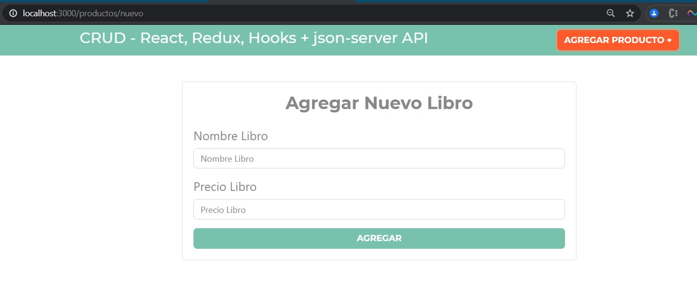
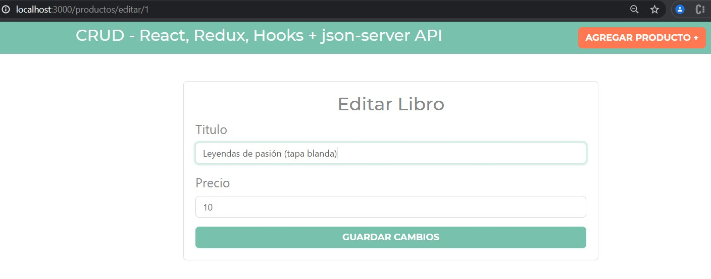
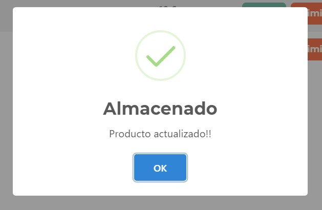
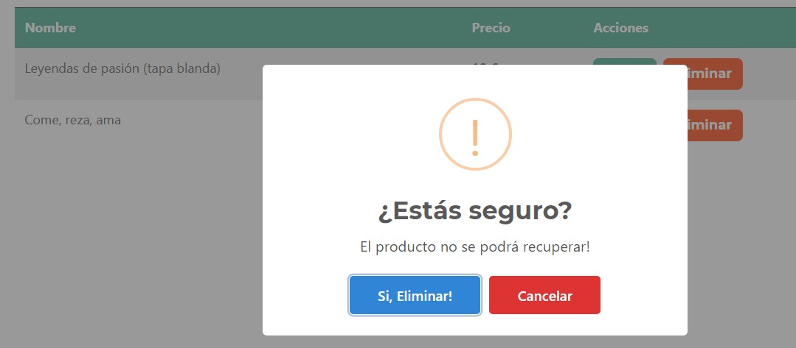
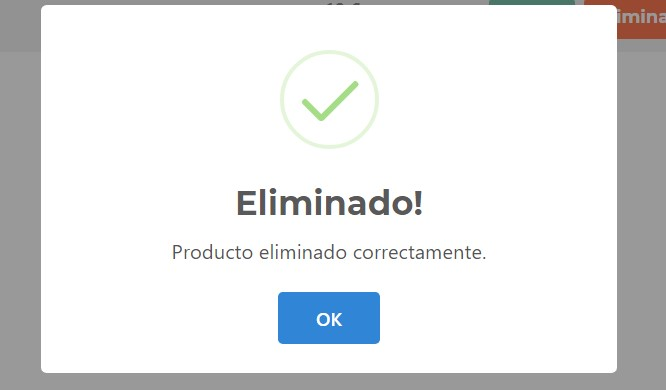

## Proyecto CRUD biblioteca 

### Tecnologías usadas:
```
React + Redux + Hooks + backend integrado: json-server
```

#### Instalación de dependencias
```
yarn startserver
```

#### Scripts de arranque

- Arranque de backend json-server en [http://localhost:4000](http://localhost:4000)
```
yarn startserver
```

- Arranque de cliente de ReactJS en [http://localhost:3000](http://localhost:3000)
```
yarn start
```
#### Comentarios de funcionamiento
Se puede ver en la herramienta de Redux, conforme se van ejecutando las acciones del reducer.
Esto es bastante útil a la hora de debuggear la aplicación

#### Vista previa
[https://gyazo.com/5c150836afe2bb70fdb75aa56cde1470](https://gyazo.com/5c150836afe2bb70fdb75aa56cde1470)

#### Capturas del proyecto
- Captura 1: Listado

####
- Captura 2: Agregar nuevo libro

####
- Captura 3: Editar libro

####
- Captura 4: Modal con mensaje de exito/error

####
- Captura 5: Modal aviso de borrado

####
- Captura 6: Modal confirmación de borrado
